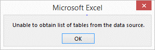
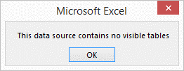

# Why?

Before diving in to understand how to query Excel from Excel, it's worth giving some thought to why this would be useful.

There's a lot of data in Excel because:

* Spreadsheets are unsurpassed in the speed of data input, where that input is from unstructured sources
* Spreadsheets are unsurpassed in the speed of data editing, where that information is from unstructured sources
* Spreadsheets allow huge flexibility in creating models

But, Excel's mainstream tools (Pivot Tables, Filters, VLOOKUP, SUMPRODUCT, SUMIF, AVERAGEIF, etc) don't allow you all the expressive power of SQL.

And some thoughts on why it's not a good idea:

* Spreadsheets don't enforce data types
* Spreadsheets don't enforce keys
* It's so easy to make a mistake

# Setting up connections
## Manually setting up a SQL connection to Excel in Excel

* Select the *Data* ribbon
* Click the *From Other Sources* button
* Select the *Data Connection Wizard*option
* Select *ODBC DSN*, click *Next*
* Select *Excel Files*, click *Next*
* Select the workbook using the *Select Workbook* dialog box

###	Errors
If you try to select the file that you are inserting the connection into (i.e. the open Excel file) you will get an "Unable to obtain list of tables from the data source" error when you select the file.



Having a connection within a file is possible, but this must be set up via VBA, not through the manual method.
If you select a file that doesn’t have any named range and then deselect the "Connect to a specific table" option you will get a "The document contains no visible table" error.



Having a connection to a file without named ranges is possible, but this must be set up via VBA, not through the manual method.

# Editing connections
##	Manually editing the SQL of a connection
* Click on table
* Select the *Design* ribbon
* Click the down arrow on the *Refresh* button
* Click *Connection Properties…*
* Select the *Definition* tab
* Edit the SQL as required
* Click *OK*

# What can be referenced

When using Excel as a data source it is possible to reference like a database table:
* Named ranges, directly by name e.g. `SELECT * FROM mynamedrange`
* Sheets, where the sheetname is followed by a dollar sign then enclosed in square brackets e.g. `SELECT * FROM [Sheet1$]`
* Ranges, similar to referencing sheets, e.g. `SELECT * FROM [Sheet1$A1:B4]`
* Sheets, where the sheet contains the result of another SQL query (similar to a View) (syntax as above)

The default connection assumes that the source ranges have header rows (there is some way not to have a header row using HDR=No, but I haven't yet got it to work).

When the table is a sheet with no range, it is assumed to start in cell A1.

Note that it is not possible to reference Excel Tables (i.e. `ListObjects`) by name. But it is possible to use them as a data source by referring to the sheet they're in.

# Limitations

## Using Tables as tables
As noted above it is not possible to query from an Excel Table referring to that table by name. However Excel Tables can be queried, by referring to the sheet they are in.


## Multiple LEFT JOINs
Using the ODBC DSN / Excel Files connection in Excel appears to suffer some of the limitations of multiple LEFT JOINs as Microsoft Access.
From: http://nm1m.blogspot.co.uk/2007/10/multiple-left-joins-in-ms-access.html
In Microsoft Access, if you want to do more than one LEFT JOIN, you have to use parenthesis in the FROM clause. So, for example, instead of just plain old:
```sql
SELECT a.columna, b.columnb, c.columnc
FROM tablea AS a
LEFT JOIN tableb AS b
ON a.id = b.id
LEFT JOIN tablec AS c
ON a.id = c.id
```
you would have to do the following:
```sql
SELECT a.columna, b.columnb, c.columnc
FROM ((tablea AS a)
    LEFT JOIN tableb AS b
    ON a.id = b.id)
LEFT JOIN tablec AS c
ON a.id = c.id
```
Otherwise, you get a "Missing Operator" error.

## SELECT * FROM LEFT JOIN

Whilst perhaps not the most elegant SQL, it is possible on other database implementations to do a `SELECT *` from a `JOIN` query, such as:
```sql
SELECT *
FROM table1
LEFT JOIN table2
ON table1.field1 = table2.field1
```
However, in Excel this will result in a syntax error.

But not always, because I tried this and it worked:
```sql
SELECT *
FROM [Sheet1$]
LEFT JOIN [Sheet2$]
ON [Sheet1$].field1 = [Sheet2$].field1
```


## Referencing self in connection string

It does not appear to be possible for a connection in a workbook to reference the workbook it's in without an absolute reference in the connection string (DBQ=) or in the query.

The following two examples work:
```vbnet
Sub AbsolutePathInQueryString()
    Sheets.Add After:=ActiveSheet
    With ActiveSheet.ListObjects.Add(SourceType:=0, Source:= _
        "ODBC;DSN=Excel Files;DBQ="";DriverId=1046;MaxBufferSize=2048;PageTimeout=5;" _
        , Destination:=Range("$A$1"))

        With .QueryTable
            .CommandText = Array("SELECT * FROM `C:\Users\Simon\Desktop\Book1.xlsm`.[Sheet1$]")
            .RowNumbers = False
            .FillAdjacentFormulas = False
            .PreserveFormatting = True
            .RefreshOnFileOpen = False
            .BackgroundQuery = True
            .RefreshStyle = xlInsertDeleteCells
            .SavePassword = False
            .SaveData = True
            .AdjustColumnWidth = True
            .RefreshPeriod = 0
            .PreserveColumnInfo = True
            .Refresh BackgroundQuery:=False
        End With
    End With
End Sub
```
And:
```vbnet
Sub AbsolutePathInConnectionString()
    Sheets.Add After:=ActiveSheet
    With ActiveSheet.ListObjects.Add(SourceType:=0, Source:= _
        "ODBC;DSN=Excel Files;DBQ=C:\Users\Simon\Desktop\Book1.xlsm;DriverId=1046;MaxBufferSize=2048;PageTimeout=5;" _
        , Destination:=Range("$A$1"))

        With .QueryTable
            .CommandText = Array("SELECT * FROM [Sheet1$]")
            .RowNumbers = False
            .FillAdjacentFormulas = False
            .PreserveFormatting = True
            .RefreshOnFileOpen = False
            .BackgroundQuery = True
            .RefreshStyle = xlInsertDeleteCells
            .SavePassword = False
            .SaveData = True
            .AdjustColumnWidth = True
            .RefreshPeriod = 0
            .PreserveColumnInfo = True
            .Refresh BackgroundQuery:=False
        End With
    End With
End Sub
```

One has a reference to the absolute path of the file in the connection string (`Source`), the other has it in the query string (`.CommandText`). If this is not the case, when the query is refreshed then a *[Microsoft][ODBC_Excel_Driver] Cannot update. Database of object is read-only* error will be shown:

![[Microsoft][ODBC_Excel_Driver] Cannot update. Database of object is read-only]([Microsoft][ODBC_Excel_Driver]_Cannot_update_Database_of_object_is_read-only.png)

This is one of the biggest limitations of querying an Excel file from itself, as if the file is moved to another folder, all the queries need to be refreshed. However, using a macro the file name and path can be updated automatically.

## Query is too complex

I tried a query that contained 77 `UNION` clauses (normalising a 2D table), and got this wonderful error message:

![[Microsoft][ODBC_Excel_Driver] Query is too complex]([Microsoft][ODBC_Excel_Driver]_Query_is_too_complex.png)

# Miscellaneous stuff to expand upon
* With a table that has a connection it is possible to add columns with calculations
* You can do relative references in the SQL, e.g.
```sql
SELECT * FROM `myworksheet.xlsx`.[sheetname$]
```
And not have any file reference in the connection string
* Doesn't like having the host workbook name in the database connection string
* Editing SQL process macro process
	* Click on table
	* Run macro
	* Edit SQL
	* OK
* Use table aliasing to avoid having to repeat workbook names and long sheet names


Sources:
<http://exceluser.com/formulas/msquery-excel-relational-data.htm>
<http://stackoverflow.com/questions/18798522/run-sql-on-excel-table>
<https://technet.microsoft.com/en-us/library/ee692882.aspx>
